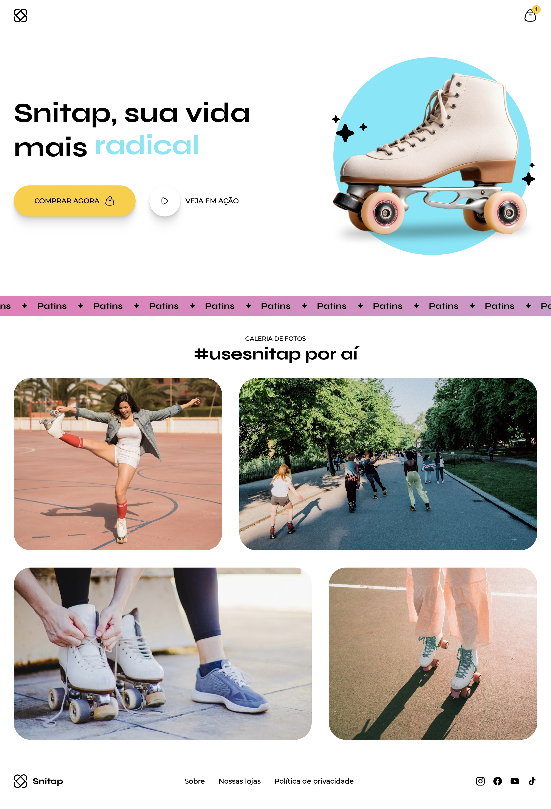

# 🛼 Snitap



## ✨ Project summary
Snitap is a lifestyle landing page for a skating brand that promotes a more **radical**, **fun**, and **healthy** life.

The page uses strong visuals, motion, and social content to present the brand, encourage engagement, and drive users to actions like **Buy now** and **Watch in action**.

## 🧰 Technologies
- HTML5
- CSS3
  - CSS variables (`:root`)
  - CSS nesting
  - `@keyframes` animations and transitions
  - Media queries
  - Scroll-driven animations (`animation-timeline: view()`)
- Google Fonts (Inter, Montserrat, Syne)

## 📁 Project structure
```text
.
├── index.html
├── assets/
│   ├── banner.svg
│   ├── hero-animation/
│   ├── icons/
│   ├── images/
│   └── profile-pic.png
└── styles/
    ├── index.css
    ├── global.css
    ├── header.css
    ├── hero.css
    ├── banner.css
    ├── gallery.css
    └── footer.css
```

## 🚀 How to run
### 1) Clone the repository
```bash
git clone https://github.com/IanGs1/snitap.git
cd snitap
```

### 2) Start locally
This is a static project, so there is no build step.

Open `index.html` directly in your browser, or run a local server (recommended):

```bash
python3 -m http.server 5500
```

Then open `http://localhost:5500`.

## 📱 Responsive behavior
The layout uses a main breakpoint at `870px` with adaptations for smaller screens, including hero reflow, spacing/typography scaling, gallery stacking, and footer layout changes.

## 🌐 Browser support
For the best experience, use a modern browser with support for CSS nesting and scroll-driven animations.

## 📝 License
Project for study and portfolio purposes.
